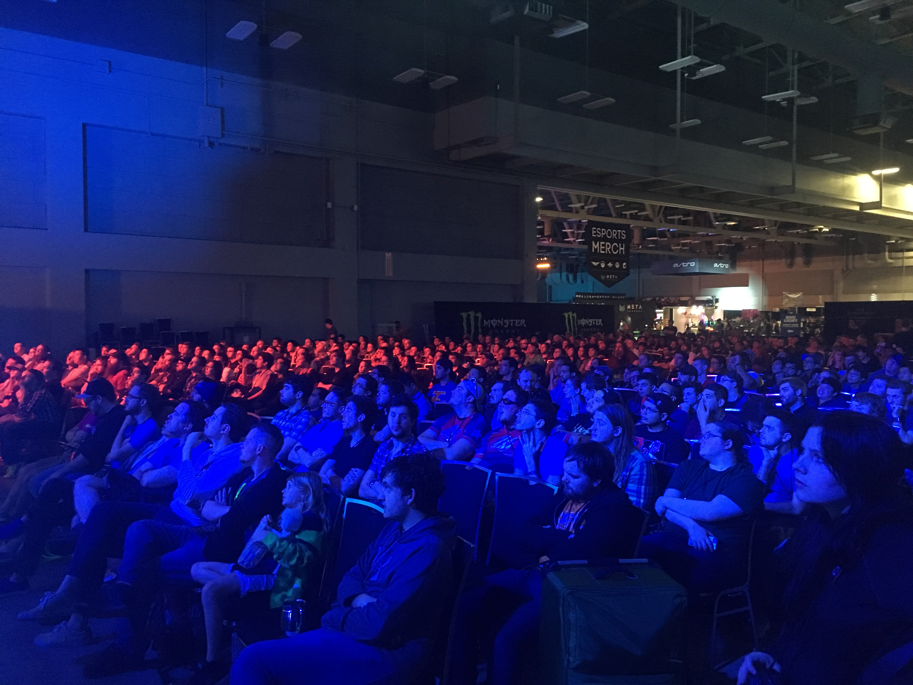
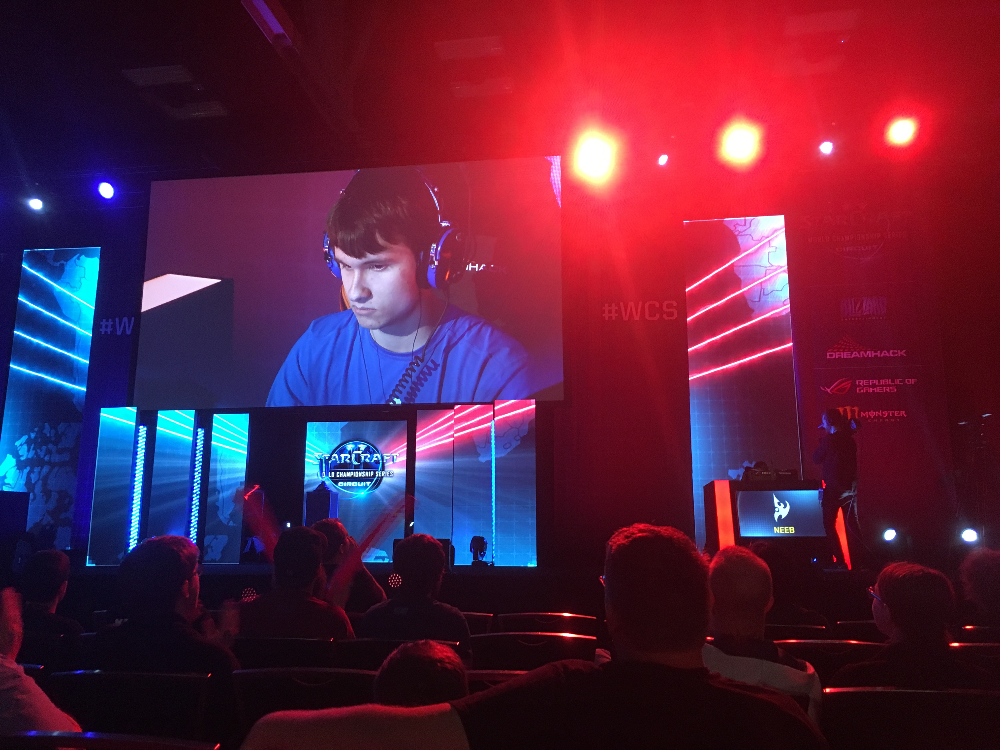
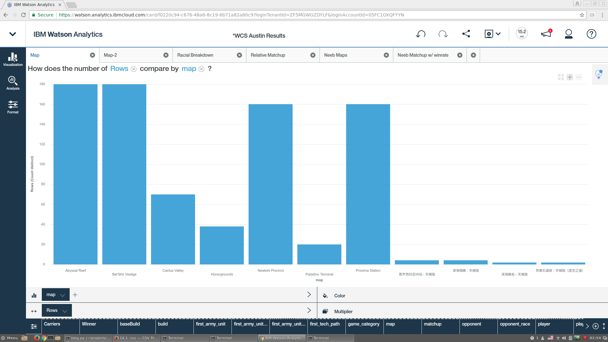
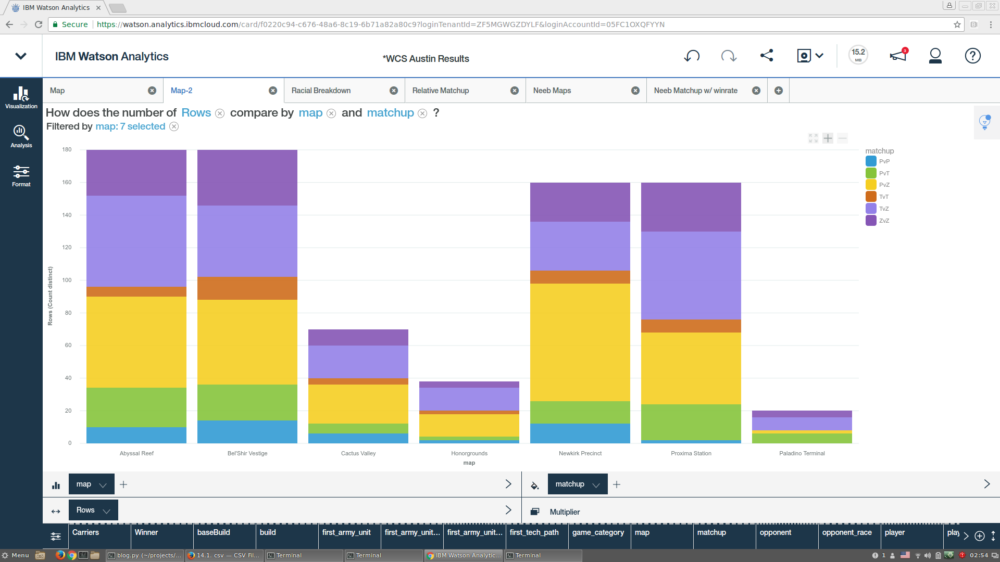
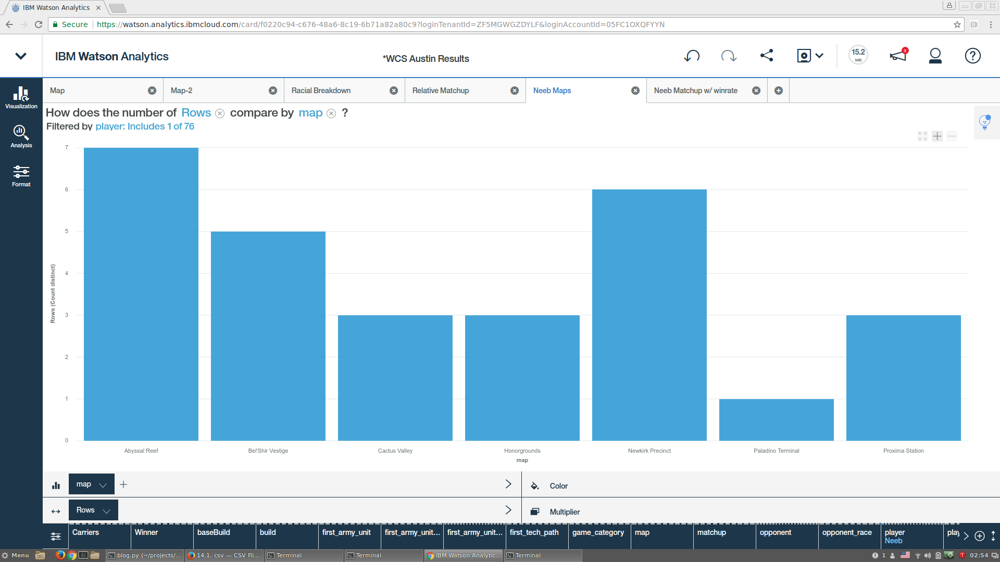
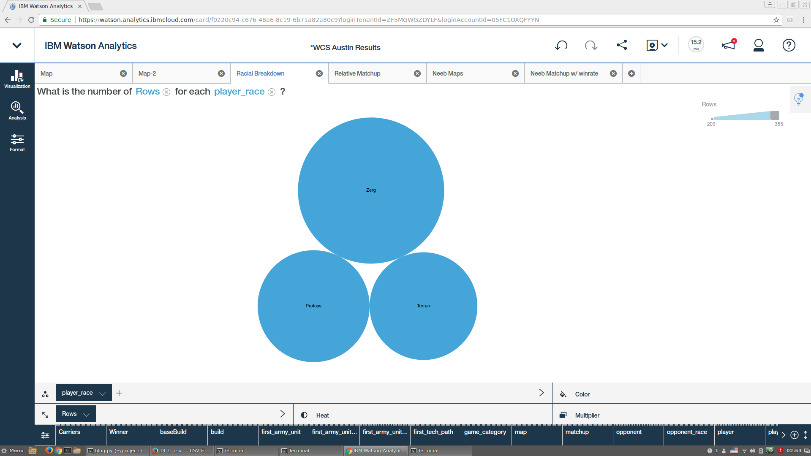
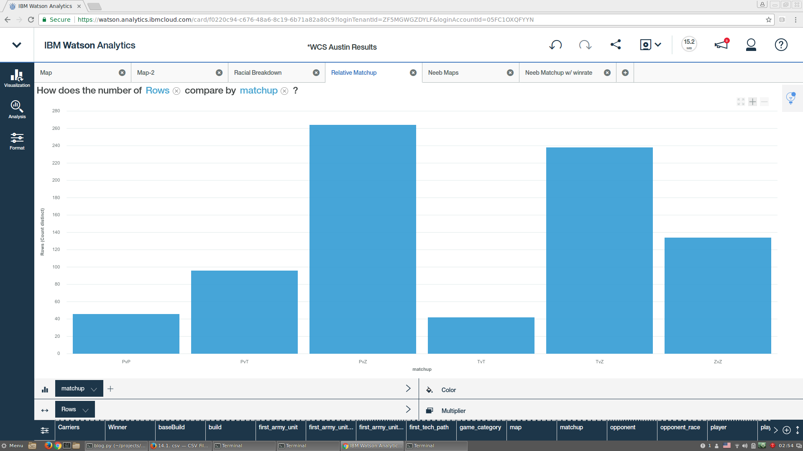
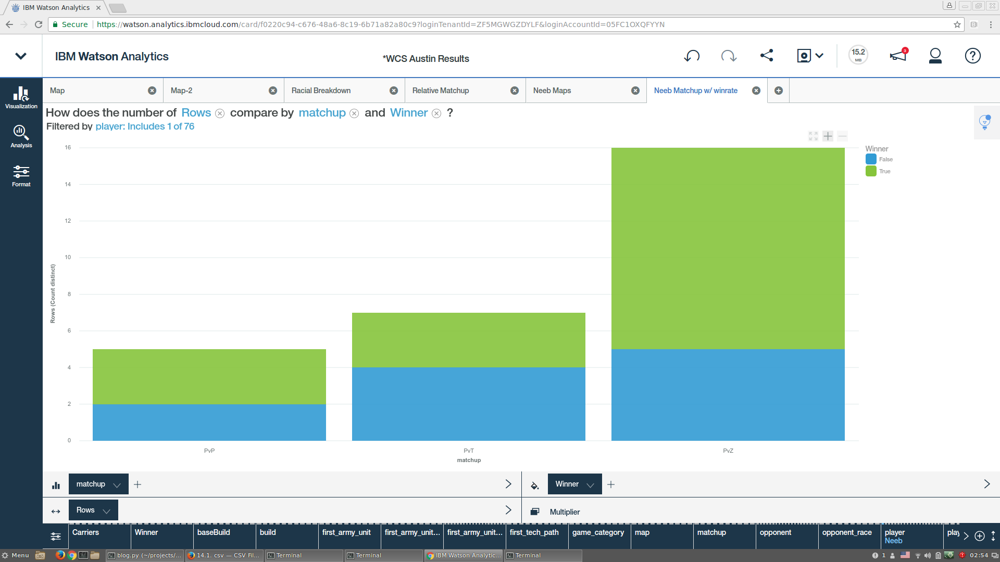
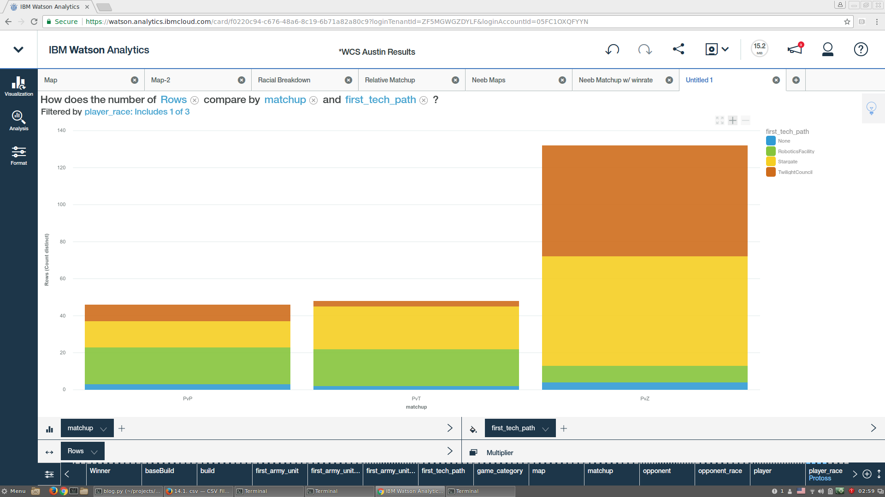
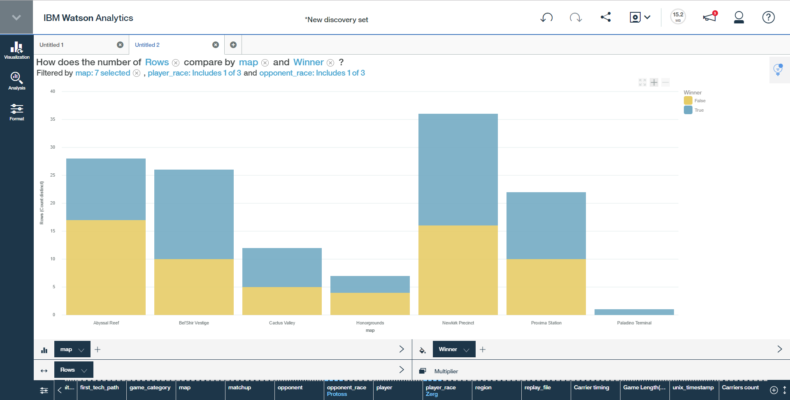

# Analysis on the WCS Austin StarCraft Tournament

In April, Europe and North America's best StarCraft players competed in the World Championship Series StarCraft tournament at DreamHack Austin. It's been three weeks since the action, and the tournament replay pack has been [released](http://us.battle.net/sc2/en/blog/20719815/wcs-austin-2017-replays-available-5-5-2017). Congratulations to American teenager Neeb on winning 1st place and $25,000. This is a brief write up on some analysis we've performed on the replays as well as an example of how this tooling could be used by professionals. For people embedded in the SC2 scene, some of these results will be expected, but whenever we work with data it's still good to get confirmation of our 'gut' feelings.

(Photos from Spencer)

### Methods

This analysis (mostly) looks at the replays in bulk and not at a particular game or series. The data was pulled from 410 .SC2Replay files pushed out in the WCS Austin replay pack. The replays were passed through [sc2reader](https://github.com/ggtracker/sc2reader) and then [some custom scripts](https://github.com/nibalizer/replay_processing) written at IBM. Finally that data was pushed into [Watson Analytics](https://www.ibm.com/analytics/watson-analytics/us-en/), a web-based tool from IBM. Most of the graphs shown here are screenshots from Watson Analytics. If anyone wants to reproduce these results, the source code is all open source and Watson Analytics has a free tier. An errors section appears at the end. This includes all three group stages and the playoffs, it does not include anything from the online qualifier.

## Map Analysis

We can count the number of games played on each map and use that to show a chart of the relative frequency of each. See the errors section for more information on this.

We can easily see that Abyssal, Bel'Shir, Newkirk, and Proxima are vastly preferred. You can also see the relative frequency of Cactus Valley, Honorgrounds, and Paladino. The inverse of this graph shows the banning frequency. Which shows that Cactus Valley, Honorgrounds, and Paladino get banned the most. But Cactus Valley gets played nearly twice as much as Honorgrounds and three times as much as Paladino. The conclusion is that your opponent is more likely to ban Honorgrounds and Paladino, so if you feel weak on Cactus Valley, you should spend your ban there. If you feel weak on Paladino, possibly you don't have to spend a ban there because it has the highest ban rate in the pool.

Next, we can overlay matchup information onto the map frequency graph.

The bars are colored based on the share of that total made up by a specific matchup. We've also filtered out the handful of Korean maps for greater clarity (see errors). This provides further information for professional players on what maps they need to practice on, and which maps are banned most frequently, so that they can better spend their bans.

We can also drill into a specific player's performance at the tournament. Looking specifically at map breakdown from Neeb, our American hero from New York, who took home 1st pace. Note the "player: Includes 1 of 76".

We need to be cautious reading too much into this because it is a relatively small data set. Still, we can see that Neeb played on all 7 maps, and that his map frequency roughly approximates the global map frequency.

## Matchup Analysis

We can look at the overall participant racial makeup.

This is slightly different from the graphs of participants on [liquipedia](http://wiki.teamliquid.net/starcraft2/2017_WCS_Austin#Distribution), this is the relative number of games played by each race. We had a lot of Zerg in the playoffs, which weights zerg heavier on this chart. We can see that we have a large proportion of Zerg players and roughly equal Terran and Protoss.

Just as we did for maps, we can compare overall matchup frequency. Each professional player will prepare for all 3 matchups (six are shown here, but any one player only experiences three). This shows us that the audience, if they watched every match, got to see a lot of PvZ and TvZ, but relatively little PvP and TvT (interestingly the only TvT games happened in the early group stages).

We can again drill into Neeb's performance.  

This time we have overlaid his win/loss rate on top of the matchups he played. The green True section corresponds to wins, the blue False section to losses. Unsurprisingly, the relative frequency of his matchups mirrored the overall relative frequency. What is interesting here is his PvT performance. Neeb went 3-5 (on maps) in the tournament, losing more maps than he won overall. This came from a 0-2 loss to Kelazhur in the group stage and a 3-2 win against SpeCIal (major).

Build order identification is beyond the scope of this post, but we can do some basic identification of first tech choices. The graphic below shows overall matchup frequency for just the Protoss players. Then overlaid on that is the first tech structure they built after the cybernetics core.

We see more or less what we expect. Heavy use of Stargate and Twilight play in PvZ and little to no Twilight openers in PvT. The narrow band of Twilight openers in PvT pops out, and begs for further analysis: Which games were those? Did Protoss win?. The blue "None" corresponds to maps where the player did not build any of the three buildings, meaning the game ended before that point - probably because of fierce cheese play.

## Conclusions

Recommendations for professional players can come out of this analysis in two forms: Recommendations for map bans and recommendations for prioritizing practice on specific map-matchup pairs. If a player is heading into a best of 3 or a best of 5 against a known opponent race, we can make data based recommendations on which maps to ban. If a player is preparing for a group where the player races are known we can make recommendations on which map-matchup pairs are the most likely to be encountered. This requires some knowledge of the opponent's race, and doesn't incorporate anything about their playstyle. Assuming a ZvP matchup, we can create the following graph.

The recommendation to the player would be this:

1) The most likely map to be banned by your opponent is Paladino. Between Honorgrounds and Cactus Valley, Cactus Valley has a much better ZvP winrate. Ban Honorgrounds.
2) The most likely map to be played and has a <50% ZvP winrate is Abyssal, that's where you should focus practice time.

### Errors

Before pushing data into Watson Analytics, we turn each replay file into two rows in a CSV file. This means the Y axis on many of these charts (map frequency for instance) is twice the actual number. This is fine when looking at a graph showing the relative frequency, but can be misleading when a user tries to find the true number. Two players, TRUE and TooDming, used Korean language settings and that is reflected in some of the replay files. In 7 cases this caused those replay files to not show in some of the analysis. Watson Analytics incorrectly reports the 'total' (see earlier note) number of maps played on Abyssal Reef as 180, but the true number is 184.

### Acknowledgments

Thanks to Garylin Kim for starting sc2reader and to David Joerg for continuing it's support. Also thanks to [brownbear](https://illiteracyhasdownsides.com/) for writing their post on Time to First Action that motivated me to share my own analysis. Also thanks to the proofreaders and the rest of the IBM Esports team: Joir-Dan Gumbs, Cullen Taylor, and Greg Haynes.
